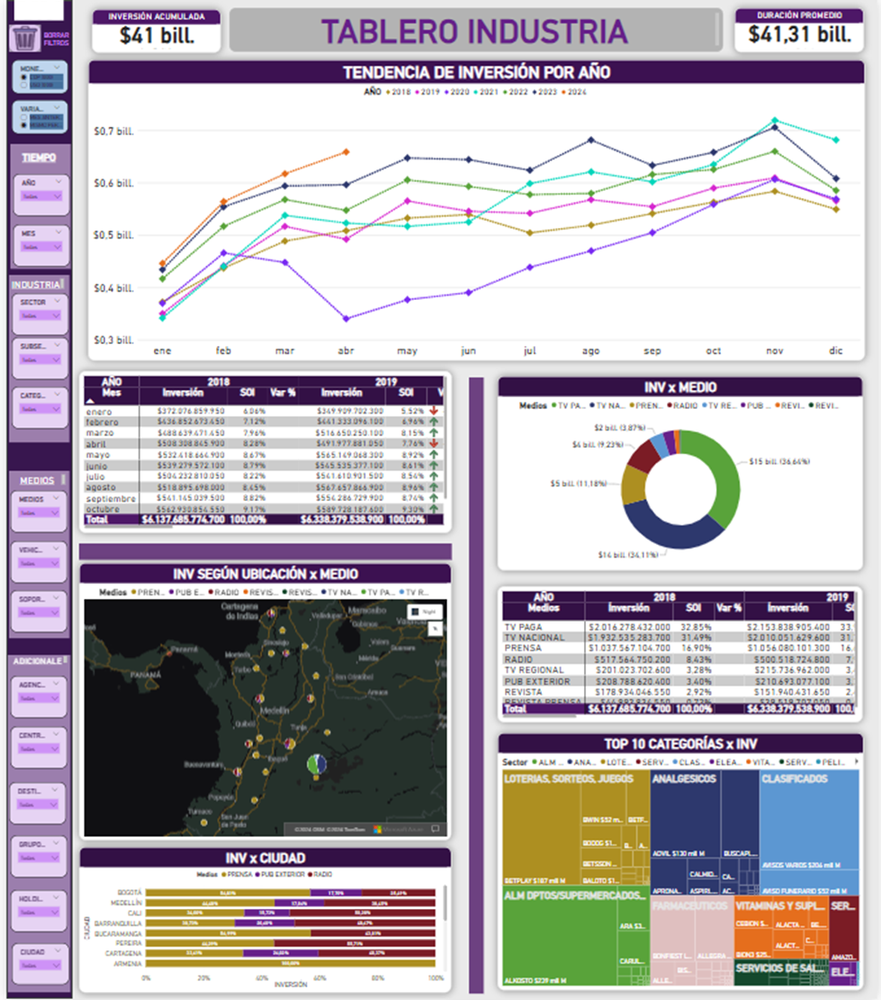
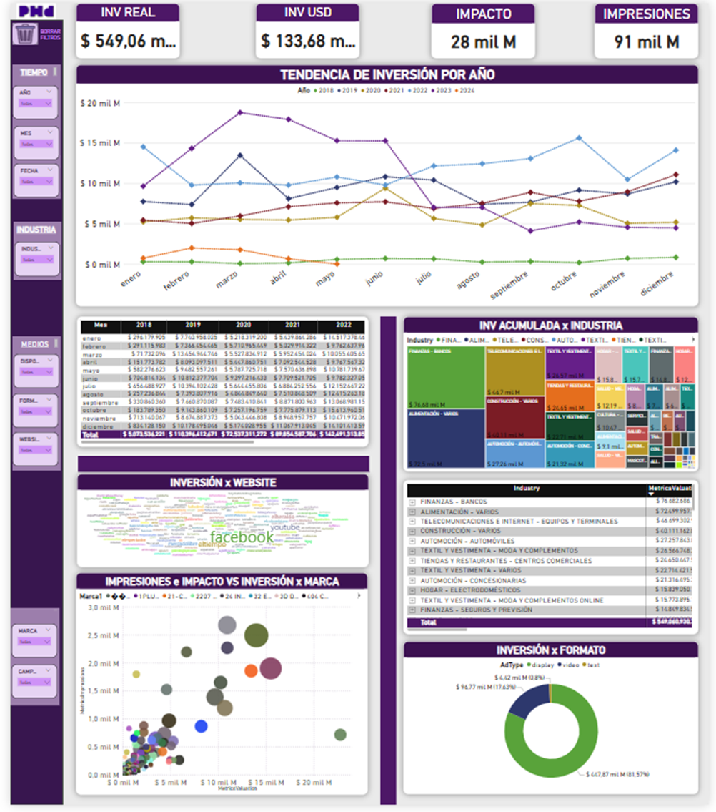
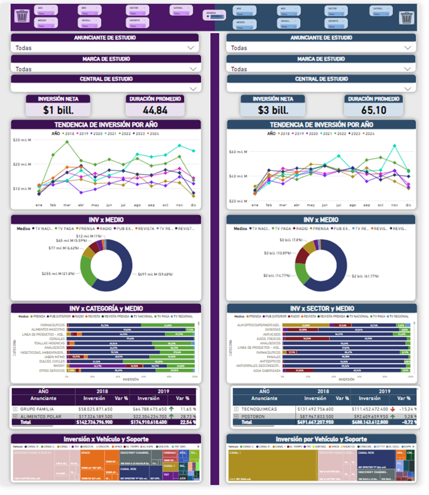

# 📊 Análisis Mensual de Inversión Publicitaria - Medios Tradicionales y Digitales

Este proyecto presenta un análisis mensual de inversión publicitaria basado en datos provenientes de medios **tradicionales** (TV, radio, prensa, OOH) y **digitales**. Utiliza **Google BigQuery** como plataforma para consolidar, transformar y modelar los datos, y **Power BI** como herramienta de visualización.

---

## 🎯 Objetivo del Proyecto

Consolidar e interpretar información de inversión publicitaria de múltiples plataformas y canales para:
- Entender tendencias mensuales de inversión.
- Comparar la participación de diferentes anunciantes en medios tradicionales y digitales.
- Facilitar decisiones estratégicas de marketing basadas en datos reales.

---

## 🧱 Componentes del Proyecto

### 📁 Carga de datos a BigQuery
- Archivos Excel con información mensual se cargan en BigQuery como tablas independientes.

### 🔍 Modelado con SQL en BigQuery
- Unión de múltiples fuentes (medios tradicionales y digitales).
- Limpieza, transformación y creación de métricas clave mediante SQL.
- Estructuración de datasets listos para visualización.

### 📊 Power BI
- Conexión directa a BigQuery para consultar los datos transformados.
- Visualizaciones interactivas que permiten:
  - Comparar inversión tradicional y digital por ciudad, sector y mes.
  - Analizar rendimiento digital a través de métricas como CPC, CTR, clics, impresiones.
  - Identificar los sectores con mayor crecimiento o caída en inversión.

---

## 🖼️ Capturas del Proyecto

<h3>Pestaña General Dashboard</h3>

<h3>Pestaña Inv Digital</h3>

<h3>Pestaña Comparativa </h3> 

---

## 🧠 Resultados y Hallazgos

- 📈 Identificación de picos de inversión por ciudad y canal durante campañas clave.
- ⚖️ Comparativo de comportamiento entre medios digitales y tradicionales.
- ⏱️ Automatización del análisis mensual mediante uso de BigQuery como backend.

---

## 🧰 Herramientas Utilizadas

| Herramienta | Propósito |
|-------------|-----------|
| Excel | Formato original de las bases mensuales |
| Google BigQuery | Almacenamiento, limpieza y modelado con SQL |
| Power BI | Visualización de datos conectada en tiempo real |

---

## 📌 Requisitos para Ejecutar

- Power BI Desktop con conexión a BigQuery habilitada.
- Acceso a los archivos Excel y proyecto en BigQuery (no incluidos por confidencialidad).

---
## 🙋 Sobre mí

👨‍💻 Sergio Martínez  
*Data Scientist | Machine Learning | Automatization*  
📫 smartinezx99@gmail.com | [LinkedIn](https://www.linkedin.com/in/sergio-mart%C3%ADnez-b26301176/)
